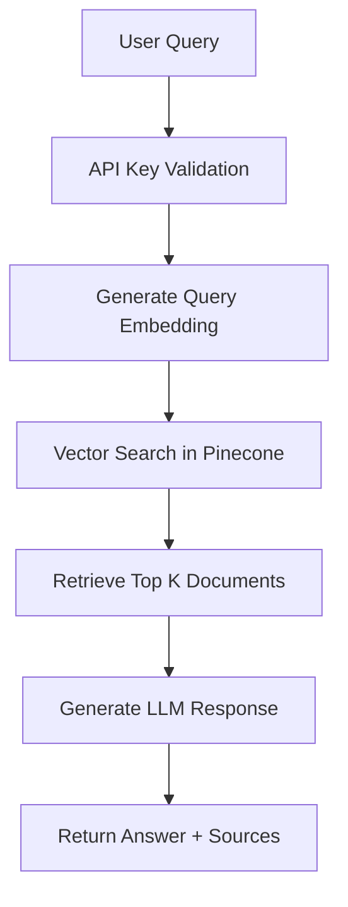
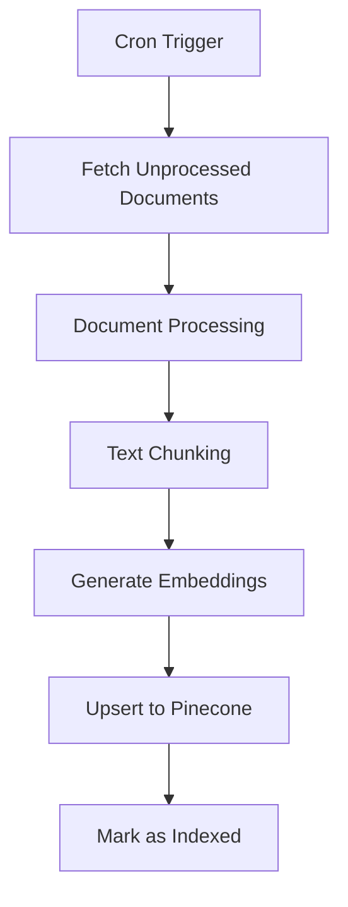

# Technical Documentation

Complete technical guide for developers working with the RAG MVP system.

## 🏗️ Architecture Overview

This MVP consists of two independent serverless functions:

1. **RAG Query Service** (`/api/rag/query`) - Direct API endpoint for querying the RAG system
2. **Ingestion Worker** (`/api/ingestion/worker`) - Background task for document processing (Cron-triggered)

### Key Features

- ✅ **Strong TypeScript Typing** - Custom interfaces and types throughout
- ✅ **Vercel Optimization** - Global client initialization to minimize cold starts
- ✅ **Security** - Mandatory API key validation for query service
- ✅ **Modularity** - Clean separation of concerns (API routes, types, utilities)
- ✅ **Vector Search** - Pinecone integration for semantic search
- ✅ **LLM Integration** - OpenAI GPT-4 for answer generation
- ✅ **Dual Storage** - Vercel Postgres + Blob Storage support

## 📁 Project Structure

```
rag-mvp-vercel/
├── app/
│   ├── api/
│   │   ├── rag/
│   │   │   └── query/
│   │   │       └── route.ts          # RAG Query Service
│   │   └── ingestion/
│   │       └── worker/
│   │           └── route.ts          # Ingestion Worker
│   ├── layout.tsx
│   └── page.tsx
├── lib/
│   ├── clients.ts                    # Global service clients (OpenAI, Pinecone)
│   └── utils.ts                      # Utility functions
├── types/
│   └── index.ts                      # TypeScript type definitions
├── db/
│   └── schema.sql                    # PostgreSQL schema
├── docs/                             # Documentation
│   ├── setup.md
│   ├── api.md
│   ├── business-case.md
│   └── technical.md
├── .env.example                      # Environment variables template
├── vercel.json                       # Vercel configuration + Cron jobs
├── package.json
├── tsconfig.json
├── next.config.js
└── README.md
```

## 🔧 Key Components

### 1. Global Service Clients (`lib/clients.ts`)

Singleton pattern for OpenAI and Pinecone clients to minimize cold start times:

```typescript
import {
  getOpenAIClient,
  getPineconeClient,
  getPineconeIndex,
} from "@/lib/clients";

// Usage in API routes
const openai = getOpenAIClient();
const index = getPineconeIndex();
```

#### Implementation Details

```typescript
// Singleton instances
let openaiClient: OpenAI | null = null;
let pineconeClient: Pinecone | null = null;
let pineconeIndex: Index | null = null;

export function getOpenAIClient(): OpenAI {
  if (!openaiClient) {
    openaiClient = new OpenAI({
      apiKey: process.env.OPENAI_API_KEY,
    });
  }
  return openaiClient;
}

export function getPineconeClient(): Pinecone {
  if (!pineconeClient) {
    pineconeClient = new Pinecone({
      apiKey: process.env.PINECONE_API_KEY!,
    });
  }
  return pineconeClient;
}

export function getPineconeIndex(): Index {
  if (!pineconeIndex) {
    const client = getPineconeClient();
    pineconeIndex = client.Index(process.env.PINECONE_INDEX_NAME!);
  }
  return pineconeIndex;
}
```

### 2. Utility Functions (`lib/utils.ts`)

Core functions for RAG operations:

#### API Key Validation

```typescript
export function validateApiKey(request: Request): boolean {
  const authHeader = request.headers.get("authorization");
  if (!authHeader?.startsWith("Bearer ")) {
    return false;
  }

  const token = authHeader.substring(7);
  return token === process.env.RAG_API_KEY;
}
```

#### Embedding Generation

```typescript
export async function generateEmbedding(text: string): Promise<number[]> {
  const openai = getOpenAIClient();

  const response = await openai.embeddings.create({
    model: process.env.EMBEDDING_MODEL || "text-embedding-3-small",
    input: text,
    dimensions: parseInt(process.env.EMBEDDING_DIMENSIONS || "1536"),
  });

  return response.data[0].embedding;
}

export async function generateEmbeddingsBatch(
  texts: string[]
): Promise<number[][]> {
  const openai = getOpenAIClient();

  const response = await openai.embeddings.create({
    model: process.env.EMBEDDING_MODEL || "text-embedding-3-small",
    input: texts,
    dimensions: parseInt(process.env.EMBEDDING_DIMENSIONS || "1536"),
  });

  return response.data.map((item) => item.embedding);
}
```

#### Vector Search

```typescript
export async function searchVectors(
  queryEmbedding: number[],
  topK: number = 5,
  includeMetadata: boolean = true
): Promise<VectorSearchResult[]> {
  const index = getPineconeIndex();

  const searchResponse = await index.query({
    vector: queryEmbedding,
    topK,
    includeMetadata,
  });

  return (
    searchResponse.matches?.map((match) => ({
      id: match.id,
      score: match.score || 0,
      content: (match.metadata?.content as string) || "",
      metadata: match.metadata || {},
    })) || []
  );
}
```

#### Text Chunking

```typescript
export function chunkText(
  text: string,
  chunkSize: number = 1000,
  overlap: number = 200
): string[] {
  const chunks: string[] = [];
  let start = 0;

  while (start < text.length) {
    const end = Math.min(start + chunkSize, text.length);
    const chunk = text.substring(start, end);
    chunks.push(chunk);

    if (end === text.length) break;
    start = end - overlap;
  }

  return chunks;
}
```

#### LLM Response Generation

```typescript
export async function generateResponse(
  query: string,
  context: string[],
  model: string = "gpt-4-turbo-preview"
): Promise<string> {
  const openai = getOpenAIClient();

  const systemPrompt = `
    You are a helpful assistant that answers questions based on the provided context.
    Use only the information from the context to answer questions.
    If the context doesn't contain enough information, say so clearly.
    Always cite your sources when possible.
  `;

  const userPrompt = `
    Context:
    ${context.join("\n\n")}
    
    Question: ${query}
    
    Answer:
  `;

  const response = await openai.chat.completions.create({
    model,
    messages: [
      { role: "system", content: systemPrompt },
      { role: "user", content: userPrompt },
    ],
    temperature: 0.7,
    max_tokens: 1000,
  });

  return response.choices[0]?.message?.content || "No response generated";
}
```

### 3. Type Definitions (`types/index.ts`)

Comprehensive TypeScript interfaces:

```typescript
// RAG Query Types
export interface RagQueryRequest {
  query: string;
  maxResults?: number;
  includeMetadata?: boolean;
}

export interface RagQueryResponse {
  answer: string;
  sources: VectorSearchResult[];
  metadata: QueryMetadata;
}

export interface QueryMetadata {
  queryProcessingTimeMs: number;
  vectorSearchTimeMs: number;
  llmGenerationTimeMs: number;
  totalDocumentsSearched: number;
  model: string;
}

// Vector Search Types
export interface VectorSearchResult {
  id: string;
  content: string;
  score: number;
  metadata?: Record<string, any>;
}

export interface VectorDocument {
  id: string;
  content: string;
  embedding: number[];
  metadata: DocumentMetadata;
}

export interface DocumentMetadata {
  title?: string;
  url?: string;
  documentType?: string;
  createdAt?: string;
  updatedAt?: string;
  author?: string;
  tags?: string[];
}

// Ingestion Types
export interface IngestionJob {
  jobId: string;
  status: "pending" | "processing" | "completed" | "failed";
  documentsProcessed: number;
  errors: string[];
  startTime: Date;
  endTime?: Date;
  duration?: number;
}

export interface IngestionRequest {
  documentIds?: string[];
  forceReprocess?: boolean;
  batchSize?: number;
}

export interface IngestionResponse {
  success: boolean;
  jobId: string;
  documentsProcessed: number;
  errors: string[];
  duration: number;
}

// Database Types
export interface DocumentRecord {
  id: string;
  title: string;
  content: string;
  url?: string;
  documentType: string;
  isIndexed: boolean;
  createdAt: Date;
  updatedAt: Date;
}

export interface EmbeddingRecord {
  id: string;
  documentId: string;
  chunkIndex: number;
  content: string;
  embedding: number[];
  createdAt: Date;
}

// Error Types
export interface ApiError {
  error: string;
  message: string;
  code?: string;
  timestamp: string;
}
```

## 🔄 Data Flow

### Query Pipeline



**Detailed Steps:**

1. **Request Validation**: Validate API key and request format
2. **Embedding Generation**: Convert query to vector embedding using OpenAI
3. **Vector Search**: Find similar documents in Pinecone using cosine similarity
4. **Context Preparation**: Prepare retrieved documents as context for LLM
5. **Response Generation**: Generate answer using OpenAI GPT with context
6. **Response Formatting**: Format response with sources and metadata

### Ingestion Pipeline



**Detailed Steps:**

1. **Job Initialization**: Create ingestion job with unique ID
2. **Document Fetching**: Query database for unprocessed documents
3. **Text Processing**: Clean and prepare document content
4. **Chunking**: Split documents into manageable chunks with overlap
5. **Batch Embedding**: Generate embeddings for all chunks
6. **Vector Storage**: Upsert embeddings to Pinecone with metadata
7. **Status Update**: Mark documents as processed in database

## 🛠️ Development

### Local Development Setup

```bash
# Install dependencies
npm install

# Set up environment variables
cp .env.example .env.local
# Fill in your API keys and configuration

# Run development server
npm run dev

# Run type checking
npm run typecheck

# Run linting
npm run lint

# Build for production
npm run build
```

### Development Scripts

```json
{
  "scripts": {
    "dev": "next dev",
    "build": "next build",
    "start": "next start",
    "typecheck": "tsc --noEmit",
    "lint": "next lint",
    "lint:fix": "next lint --fix"
  }
}
```

### Code Quality

#### TypeScript Configuration

```json
{
  "compilerOptions": {
    "target": "ES2022",
    "lib": ["dom", "dom.iterable", "ES2022"],
    "allowJs": true,
    "skipLibCheck": true,
    "strict": true,
    "noEmit": true,
    "esModuleInterop": true,
    "module": "esnext",
    "moduleResolution": "bundler",
    "resolveJsonModule": true,
    "isolatedModules": true,
    "jsx": "preserve",
    "incremental": true,
    "plugins": [
      {
        "name": "next"
      }
    ],
    "baseUrl": ".",
    "paths": {
      "@/*": ["./*"]
    }
  },
  "include": ["next-env.d.ts", "**/*.ts", "**/*.tsx", ".next/types/**/*.ts"],
  "exclude": ["node_modules"]
}
```

#### ESLint Configuration

```json
{
  "extends": ["next/core-web-vitals", "@typescript-eslint/recommended"],
  "rules": {
    "@typescript-eslint/no-unused-vars": "error",
    "@typescript-eslint/no-explicit-any": "warn",
    "prefer-const": "error",
    "no-var": "error"
  }
}
```

### Testing

#### Unit Testing Setup

```bash
npm install --save-dev jest @types/jest ts-jest
```

```javascript
// jest.config.js
module.exports = {
  preset: "ts-jest",
  testEnvironment: "node",
  moduleNameMapping: {
    "^@/(.*)$": "<rootDir>/$1",
  },
  setupFilesAfterEnv: ["<rootDir>/jest.setup.js"],
};
```

#### Example Tests

```typescript
// __tests__/utils.test.ts
import { validateApiKey, chunkText, generateEmbedding } from "@/lib/utils";

describe("Utility Functions", () => {
  describe("validateApiKey", () => {
    it("should validate correct API key", () => {
      const request = new Request("http://localhost", {
        headers: { authorization: "Bearer valid-key" },
      });

      process.env.RAG_API_KEY = "valid-key";
      expect(validateApiKey(request)).toBe(true);
    });

    it("should reject invalid API key", () => {
      const request = new Request("http://localhost", {
        headers: { authorization: "Bearer invalid-key" },
      });

      process.env.RAG_API_KEY = "valid-key";
      expect(validateApiKey(request)).toBe(false);
    });
  });

  describe("chunkText", () => {
    it("should chunk text correctly", () => {
      const text = "A".repeat(1500);
      const chunks = chunkText(text, 1000, 200);

      expect(chunks).toHaveLength(2);
      expect(chunks[0]).toHaveLength(1000);
      expect(chunks[1]).toHaveLength(700); // 1500 - 800 (1000 - 200 overlap)
    });
  });
});
```

#### Integration Testing

```typescript
// __tests__/api.test.ts
import { GET, POST } from "@/app/api/rag/query/route";

describe("/api/rag/query", () => {
  beforeEach(() => {
    process.env.RAG_API_KEY = "test-key";
    process.env.OPENAI_API_KEY = "test-openai-key";
    process.env.PINECONE_API_KEY = "test-pinecone-key";
  });

  it("should return health check", async () => {
    const request = new Request("http://localhost/api/rag/query", {
      method: "GET",
      headers: { authorization: "Bearer test-key" },
    });

    const response = await GET(request);
    expect(response.status).toBe(200);

    const data = await response.json();
    expect(data.status).toBe("healthy");
  });

  it("should reject invalid API key", async () => {
    const request = new Request("http://localhost/api/rag/query", {
      method: "POST",
      headers: {
        "content-type": "application/json",
        authorization: "Bearer invalid-key",
      },
      body: JSON.stringify({ query: "test" }),
    });

    const response = await POST(request);
    expect(response.status).toBe(401);
  });
});
```

## 🔒 Security

### API Key Protection

#### Environment Variables

```bash
# Use strong, random API keys
RAG_API_KEY=$(openssl rand -base64 32)
CRON_SECRET=$(openssl rand -base64 32)
```

#### Validation Implementation

```typescript
export function validateApiKey(request: Request): boolean {
  const authHeader = request.headers.get("authorization");

  if (!authHeader?.startsWith("Bearer ")) {
    return false;
  }

  const token = authHeader.substring(7);
  const expectedKey = process.env.RAG_API_KEY;

  if (!expectedKey) {
    console.error("RAG_API_KEY not configured");
    return false;
  }

  // Use constant-time comparison to prevent timing attacks
  return crypto.timingSafeEqual(Buffer.from(token), Buffer.from(expectedKey));
}
```

### Rate Limiting

```typescript
// lib/rate-limit.ts
import { LRUCache } from "lru-cache";

type Options = {
  uniqueTokenPerInterval?: number;
  interval?: number;
};

export default function rateLimit(options: Options = {}) {
  const tokenCache = new LRUCache({
    max: options.uniqueTokenPerInterval || 500,
    ttl: options.interval || 60000,
  });

  return {
    check: (limit: number, token: string) =>
      new Promise<void>((resolve, reject) => {
        const tokenCount = (tokenCache.get(token) as number[]) || [0];

        if (tokenCount[0] === 0) {
          tokenCache.set(token, tokenCount);
        }

        tokenCount[0] += 1;

        const currentUsage = tokenCount[0];
        const isRateLimited = currentUsage >= limit;

        return isRateLimited ? reject() : resolve();
      }),
  };
}

// Usage in API route
const limiter = rateLimit({
  interval: 60 * 1000, // 60 seconds
  uniqueTokenPerInterval: 500, // Limit each IP to 500 requests per interval
});

export async function POST(request: Request) {
  try {
    await limiter.check(10, getIP(request)); // 10 requests per minute per IP
  } catch {
    return new Response("Rate limit exceeded", { status: 429 });
  }

  // ... rest of the handler
}
```

### Input Sanitization

```typescript
export function sanitizeInput(input: string): string {
  // Remove potentially dangerous characters
  return input
    .replace(/[<>]/g, "") // Remove HTML tags
    .replace(/javascript:/gi, "") // Remove JavaScript URLs
    .replace(/on\w+=/gi, "") // Remove event handlers
    .trim()
    .substring(0, 10000); // Limit length
}

export function validateQueryRequest(body: any): RagQueryRequest {
  if (!body || typeof body !== "object") {
    throw new Error("Invalid request body");
  }

  if (!body.query || typeof body.query !== "string") {
    throw new Error("Query is required and must be a string");
  }

  if (body.query.length > 10000) {
    throw new Error("Query too long (max 10,000 characters)");
  }

  return {
    query: sanitizeInput(body.query),
    maxResults: Math.min(Math.max(1, body.maxResults || 5), 20), // Limit to 1-20
    includeMetadata: Boolean(body.includeMetadata ?? true),
  };
}
```

## 🚨 Troubleshooting

### Common Issues

#### Cold Start Performance

**Problem**: First request after deployment is slow (500-1000ms)

**Solution**:

```typescript
// Pre-initialize clients during module load
const openaiClient = new OpenAI({
  apiKey: process.env.OPENAI_API_KEY,
});

const pineconeClient = new Pinecone({
  apiKey: process.env.PINECONE_API_KEY!,
});

// Keep connections warm
export const runtime = "edge"; // Use Edge Runtime for faster cold starts
```

#### Vector Search Returns No Results

**Problem**: Queries don't return relevant documents

**Debugging Steps**:

1. Verify Pinecone index has documents:

   ```typescript
   const stats = await index.describeIndexStats();
   console.log("Total vectors:", stats.totalVectorCount);
   ```

2. Check embedding dimensions:

   ```typescript
   const embedding = await generateEmbedding("test");
   console.log("Embedding dimensions:", embedding.length);
   // Should match EMBEDDING_DIMENSIONS (1536 for text-embedding-3-small)
   ```

3. Test vector search directly:
   ```typescript
   const results = await searchVectors(embedding, 10, true);
   console.log("Search results:", results.length);
   ```

#### Memory Issues

**Problem**: Function runs out of memory during batch processing

**Solution**:

```typescript
// Process documents in smaller batches
export async function processBatch(
  documents: DocumentRecord[],
  batchSize = 10
) {
  const results = [];

  for (let i = 0; i < documents.length; i += batchSize) {
    const batch = documents.slice(i, i + batchSize);
    const batchResults = await processBatchInternal(batch);
    results.push(...batchResults);

    // Give time for garbage collection
    if (i % 50 === 0) {
      await new Promise((resolve) => setTimeout(resolve, 100));
    }
  }

  return results;
}
```

#### API Rate Limits

**Problem**: OpenAI or Pinecone rate limit exceeded

**Solution**:

```typescript
export async function retryWithBackoff<T>(
  fn: () => Promise<T>,
  maxRetries = 3,
  baseDelay = 1000
): Promise<T> {
  for (let i = 0; i < maxRetries; i++) {
    try {
      return await fn();
    } catch (error) {
      if (i === maxRetries - 1) throw error;

      const delay = baseDelay * Math.pow(2, i) + Math.random() * 1000;
      await new Promise((resolve) => setTimeout(resolve, delay));
    }
  }

  throw new Error("Max retries exceeded");
}

// Usage
const embedding = await retryWithBackoff(() =>
  openai.embeddings.create({
    /* params */
  })
);
```

### Performance Optimization

#### Embedding Caching

```typescript
import { LRUCache } from "lru-cache";

const embeddingCache = new LRUCache<string, number[]>({
  max: 1000, // Cache up to 1000 embeddings
  ttl: 1000 * 60 * 60, // 1 hour TTL
});

export async function generateEmbeddingCached(text: string): Promise<number[]> {
  const cacheKey = crypto.createHash("sha256").update(text).digest("hex");

  const cached = embeddingCache.get(cacheKey);
  if (cached) {
    return cached;
  }

  const embedding = await generateEmbedding(text);
  embeddingCache.set(cacheKey, embedding);

  return embedding;
}
```

#### Database Connection Pooling

```typescript
// lib/db.ts
import { Pool } from "pg";

let pool: Pool | null = null;

export function getDbPool(): Pool {
  if (!pool) {
    pool = new Pool({
      connectionString: process.env.POSTGRES_URL,
      max: 20, // Maximum number of clients in the pool
      idleTimeoutMillis: 30000, // Close idle clients after 30 seconds
      connectionTimeoutMillis: 2000, // Return an error after 2 seconds if connection could not be established
    });
  }

  return pool;
}

export async function queryDb<T>(
  query: string,
  params: any[] = []
): Promise<T[]> {
  const pool = getDbPool();
  const client = await pool.connect();

  try {
    const result = await client.query(query, params);
    return result.rows;
  } finally {
    client.release();
  }
}
```

### Monitoring and Logging

#### Structured Logging

```typescript
export interface LogEntry {
  timestamp: string;
  level: "info" | "warn" | "error" | "debug";
  message: string;
  metadata?: Record<string, any>;
}

export function log(
  level: LogEntry["level"],
  message: string,
  metadata?: Record<string, any>
) {
  const entry: LogEntry = {
    timestamp: new Date().toISOString(),
    level,
    message,
    metadata,
  };

  console.log(JSON.stringify(entry));
}

// Usage
log("info", "Processing query", {
  queryLength: query.length,
  maxResults,
  userId: request.headers.get("x-user-id"),
});
```

#### Performance Monitoring

```typescript
export class PerformanceMonitor {
  private timers = new Map<string, number>();

  start(label: string): void {
    this.timers.set(label, Date.now());
  }

  end(label: string): number {
    const start = this.timers.get(label);
    if (!start) {
      throw new Error(`Timer ${label} not found`);
    }

    const duration = Date.now() - start;
    this.timers.delete(label);

    log("info", `Performance: ${label}`, { durationMs: duration });
    return duration;
  }

  measure<T>(label: string, fn: () => Promise<T>): Promise<T> {
    this.start(label);
    return fn().finally(() => this.end(label));
  }
}

// Usage
const monitor = new PerformanceMonitor();

const embedding = await monitor.measure("embedding-generation", () =>
  generateEmbedding(query)
);

const searchResults = await monitor.measure("vector-search", () =>
  searchVectors(embedding, maxResults)
);
```
